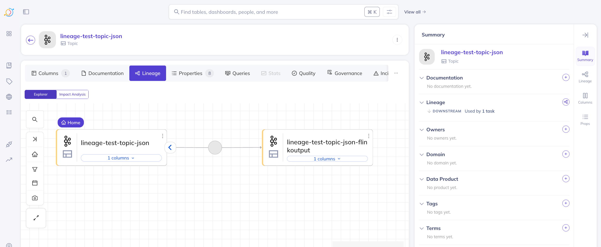

# About this repository
## What's the purpose of this repository?
It's a POC demonstrating how can you integrate Flink 2.0 with DataHub using OpenLineage, in order to visualize 
Stream Lineage graph. It's extremely minimalistic - just the bare minimum necessary to see the graph. The 
only unnecessary part is the Schema Registry, but I'm leaving it in. Hopefully it will be useful - it's integrated
with Kafka UI and Datahub using environment variables.

## What's in this repository?
All deployed locally using Docker Compose

### Kafka
- Kafka 4.0
- Kafka UI
- Schema Registry
- Kafka Rest Proxy

### Flink 2.0
- Flink jobmanager

Jobmanager has Sql Gateway enabled, so it's easier to submit FlinkSQL jobs programmatically.
- Flink taskmanager
- Custom openlineage-flink jar and other necessary jars in ./flink-jars.

### Datahub
- Basic setup based on https://github.com/datahub-project/datahub/blob/master/docker/quickstart/docker-compose.quickstart.yml

### request-logger-proxy
This is a simple ngingx proxy that forwards all incoming requests to datahub-gms, but also logs them to the console.
Because Datahub supports OpenLineage through a http enpoint only, this is very helpful when debugging OpenLineage. 

## How to run it?

### WARNING: This setup is very fragile. Make sure that you follow the instructions to the letter.

### 1. Run all services except request-logger-proxy
```bash
  docker compose up -d kafka-ui flink-taskmanager datahub-frontend-react datahub-actions
```
request-logger-proxy is the connection between flink and DataHub, there is a bug in DataHub that makes RUNNING lineage 
events break the graph - the workaround for this POC is to only keep the connection running for the START event.

### 2. Once everything is up, run the scripts that will result in creation of two kafka topics:
```bash
  ./scripts/send-kafka-message.sh
  ./scripts/submit-flinksql-job.sh
```

### 3. Validate topics were created
To validate that everything is working, validate in Kafka UI (`localhost:8090`) that the following topics were created 
and both contain at least one message. It could take up to ~30 seconds for the topics to appear.
- lineage-test-topic-json
- lineage-test-topic-json-flinkoutput

### 4. Ingest Kafka metadata in Datahub:
- Log into Datahub UI (`localhost:9002`), credentials datahub/datahub
- Check if you can see the Data Sources tab in the left sidebar. 

If you don't, deleting and recreating datahub-gms and 
datahub-frontend-react could should fix it. Waiting a bit helped as well. Datahub is frustrating. Once you see it,
proceed to the next step.
- Data Sources -> Create new source -> Kafka
  - Screen 2: 
    - Bootstrap servers: kafka:9094
    - Schema Registry URL: http://schema-registry:8081
  - Screen 4:
    - Name: Kafka local (or whatever you want)
After that you can click Save & Run. This will ingest metadata from Kafka topics and Schema Registry. 
Once it's done (takes ~15 seconds), you should be able to see the topics in Datahub UI. In the main scree on the top is
the search bar. Type nothing and click enter. You should see ~10 kafka topics.

### 5. Delete the Flink containers and start them again.
Now that your topics are present, delete the Flink containers and start them again. Cancelling the job might work, but
most consistent way is just full recreation.
```bash
  docker compose down flink-jobmanager flink-taskmanager
  docker compose up -d flink-taskmanager  
```

### 6. Start the request-logger-proxy and start monitoring the logs.
Open a new terminal and run the following command:
```bash
  docker compose up request-logger-proxy
```
This will start the request-logger-proxy and attach to the container. This is important, because you'll need to stop 
this container after the first request is sent.

### The next part is time sensitive
You have 60 seconds to complete steps 7 and 8. Read them both before progressing forward.
### 7. Submit the FlinkSQL job again using the script (make sure your flink containers have been recreated and are running):
```bash
  ./scripts/submit-flinksql-job.sh
```
The job will consume the already published message, but this time when the Lineage Events are sent to Datahub, the Kafka metadata 
is already there - and you should be able to see the Stream Lineage graph in Datahub UI.

### 8. Stop the request-logger-proxy container:
```bash
  docker compose stop request-logger-proxy
```

### 9. View the Lineage Graph in DataHub:
- Open Datahub UI (`localhost:9002`)
- Search for the topic `lineage-test-topic-json`
- Click on the Lineage tab

This is what you should see:



## Known issues

## DataHub OpenLineage ingestion bug

DataHub correctly processes START event, but when it receives RUNNING event - it logs a stacktrace and the lineage graph
is broken. The workaround is to only keep the connection running for the START event, as detailed in the instructions above.

Another approach is to increase the `openlineage.trackingIntervalInSeconds` in the openlineage config to some absurd value,
but this would produce very unexpected results if anyone used that code.

Bug ticket: https://github.com/datahub-project/datahub/issues/13854

## Custom-built openlineage-flink jar

This project contains a custom-built openlineage-flink jar containing a bugfix that makes it possible. It's been merged
to openlineage-flink already, but isn't released yet.

Code it's built from is published on Github as a PR to the OpenLineage project:
https://github.com/OpenLineage/OpenLineage/pull/3799
The change has already been merged to main, so with the next release it won't require a custom jar anymore.

